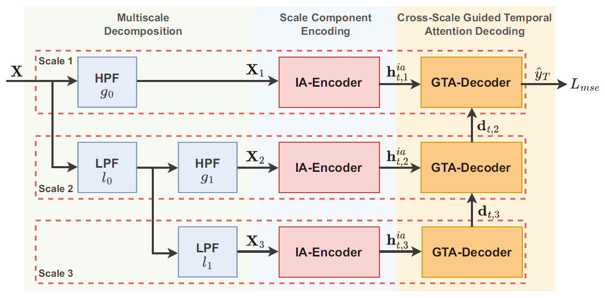

# MRN-CSG
Q. Guo, L. Fang, R. Wang, and C. Zhang, [Multivariate Time Series Forecasting Using Multiscale Recurrent Networks with Scale Attention and Cross-Scale Guidance](https://doi.org/10.1109/TNNLS.2023.3326140), *IEEE Transactions on Neural Networks and Learning Systems*, accepted 2023.

# Framework

# Requirements
tensorflow-gpu==1.12,
cudatoolkit==9.0,
cudnn==7.3.1,
numpy==1.19.5,
pandas,
matplotlib,
scikit_learn,
tensorboard
